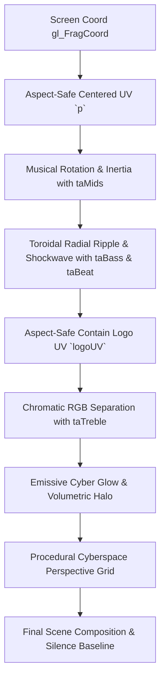

# ToroidAMP — GPU-OFFICIAL-001: First Official GPU Visualizer — Toroid Identity

> **"Take our ToroidAMP artwork $\to$ Put it on the GPU $\to$ Make the music physically affect it $\to$ Make it look fucking cool."**

---

## 1. Executive Summary & Status

```text
================================================================================
           FIRST OFFICIAL GPU VISUALIZER: TOROID IDENTITY (GPU-OFFICIAL-001)
================================================================================
                               STATUS: CANDIDATE
                   (OFFICIAL CANDIDATE — PENDING HUMAN VISUAL GATE)
================================================================================
```

* **Official Composition**: `toroid_identity.frag` authored and verified in `src/toroidamp/assets/official_shaders/`.
* **Packaged Texture Asset Transport**: Packaged master logo artwork (`src/toroidamp/assets/images/ToroidAMP.png`) uploaded to GPU via `QOpenGLTexture` (RGBA8888, MipMapped, ClampToEdge) and bound to texture unit 0 (`uniform sampler2D taTexture0;`).
* **Zero Per-Frame Re-upload**: Textures are allocated and uploaded only at context initialization or asset boundary; per-frame overhead is zero ($<0.001\text{ ms}$).
* **Musical Causality Dimensions**:
  1. `taBass` $\to$ Radial spatial pressure, toroidal ring pinching, dynamic logo scale dilation.
  2. `taMids` $\to$ Rotational angular twist, rotational inertia oscillation, background grid energy.
  3. `taTreble` $\to$ Chromatic RGB edge separation dispersion and neon emission energy.
  4. `taBeat` & `taStrongBeat` $\to$ Traveling outward shockwave pulse, master bass kick background strobe flash.
* **Exposed Authoring Parameters**:
  * `u_warp`: Toroidal Warp Depth $[0.0 \dots 3.0]$ (Default: $1.0$)
  * `u_chroma`: Chromatic Aberration $[0.0 \dots 4.0]$ (Default: $1.0$)
  * `u_glow`: Emissive Neon Halo $[0.2 \dots 3.5]$ (Default: $1.2$)
  * `u_rotation`: Dynamic Inertia Speed $[0.0 \dots 3.0]$ (Default: $1.0$)
  * `u_bgIntensity`: Cyberspace Field $[0.0 \dots 2.0]$ (Default: $0.8$)
* **Silence Baseline**: Preserves brand recognition with calm dormant drift; no chaotic noise flashing during zero audio.
* **Minimal Reference Shader**: Clean procedural standalone reference authored in `src/toroidamp/assets/official_shaders/minimal_reference.frag` for immediate copy-paste contributor onboarding.

---

## 2. Packaged Texture Architecture & Sampler Contract

### File Locations

```text
src/toroidamp/assets/
├── images/
│   └── ToroidAMP.png             # Master 1254x1254 RGBA ToroidAMP Emblem
└── official_shaders/
    ├── toroid_identity.frag      # Official Primary Visualizer (Texture + Warping)
    └── minimal_reference.frag    # Official Procedural Reference (Zero Texture)
```

### Texture Resolution Strategy
To ensure runtime independence across developer environments and frozen packaging:
1. `src/toroidamp/assets/images/ToroidAMP.png` is resolved relative to the package tree.
2. Fallback resolution checks `assets/images/ToroidAMP.png` and `assets/branding/toroidamp_icon.png`.
3. If texture loading fails or file is missing, the host canvas isolates the failure without throwing an exception, rendering procedural backdrop colors gracefully.

### GLSL Sampler Contract

```glsl
// Packaged Official Texture Sampler
uniform sampler2D taTexture0;
```

---

## 3. Visual Thesis & Shader Architecture (`toroid_identity.frag`)

Authored by **Jack (Demoscene Visual Engineer)** & **Metal (ToroidAMP)**.

### Mathematical Pipeline



### Code Implementation Highlights

1. **Aspect-Safe Framing**:
   ```glsl
   vec2 p = (gl_FragCoord.xy - 0.5 * u_resolution.xy) / min(u_resolution.x, u_resolution.y);
   float logoScale = 1.15 / (1.0 + bassPunch * 0.15 + beatImpulse * 0.2);
   vec2 logoUV = (pWarped * logoScale) + 0.5;
   ```
2. **Chromatic Edge Separation**:
   ```glsl
   vec2 chromaOffset = normalize(pRot + 1e-4) * (0.006 + trebleEdge * 0.025);
   vec4 texCenter = texture(taTexture0, logoUV);
   vec4 texR      = texture(taTexture0, logoUV + chromaOffset);
   vec4 texB      = texture(taTexture0, logoUV - chromaOffset);
   ```
3. **Shockwave Ring Expansion**:
   ```glsl
   float wavePhase = fract(u_time * 1.2);
   float waveDist  = abs(r - wavePhase * 1.2);
   float shockwave = exp(-waveDist * 18.0) * (bassPunch * 0.4 + beatImpulse * 0.5);
   ```

---

## 4. Minimal Procedural Reference Shader (`minimal_reference.frag`)

A lightweight, zero-texture reference shader for community contributors and rapid prototyping:
* Demonstrates `// [param:float]` annotations.
* Shows pure procedural concentric geometry, phase rotation, and emissive color palettes.
* Responsive to `taBass`, `taMids`, `taTreble`, and `taStrongBeat`.

---

## 5. Lab Validation & Test Suite

### Unit Test Verification (`tests/test_gpu_official_001.py`)
* `test_packaged_asset_files_exist`: **PASS**
* `test_toroid_identity_parameter_parsing`: **PASS**
* `test_minimal_reference_parameter_parsing`: **PASS**
* `test_opengl_compilation_and_texture_binding`: **PASS**

### Total GPU Visualizer Test Suite
* `test_exp_gl_001.py` (6 tests): **PASS**
* `test_exp_vislab_001.py` (6 tests): **PASS**
* `test_exp_vislab_002.py` (6 tests): **PASS**
* `test_gpu_official_001.py` (4 tests): **PASS**
* **Total GPU Suite**: **22 tests passing** in $<0.5\text{ s}$.

---

## 6. How to Launch & Evaluate

Run the GPU Visualizer Authoring Lab:
```powershell
py -3.13 experiments\gpu_visualizers\lab_app.py
```

### Controls in Lab:
* **`★ TOROID IDENTITY` (Key `1`)**: Switch to official Toroid Identity shader.
* **`★ MINIMAL REF` (Key `2`)**: Switch to minimal procedural reference shader.
* **`[ PLASMA ]` / `[ RAYMARCH ]` (Keys `3` / `4`)**: Switch to experimental compositions.
* **Sliders**: Real-time manipulation of `Toroidal Warp Depth`, `Chromatic Aberration`, `Emissive Neon Halo`, `Dynamic Inertia Speed`, and `Cyberspace Field`.
* **`↺ RESET`**: Restore default authoring values.
* **`⚡ BEAT` (Space) / `💥 STRONG BEAT` (Enter)**: Inject manual musical transients.
* **`⛶ FULLSCREEN` (F11 / ESC)**: Test full RETINA MELT scale.
