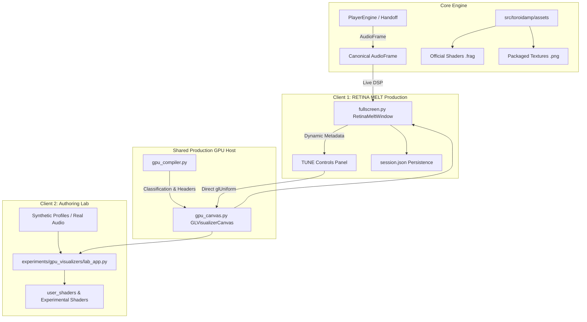

# ToroidAMP — GPU-PROD-001: RETINA MELT GPU Host Integration + Live Tune Controls

---

## 1. Executive Summary & Purpose

```text
================================================================================
           RETINA MELT GPU HOST INTEGRATION & LIVE TUNE CONTROLS (GPU-PROD-001)
================================================================================
STATUS        : OPEN / HUMAN GATE FAILED — STABILIZATION CUT IN PROGRESS
CORE PRINCIPLE: NORMAL/MINI -> LISTEN TO THE MUSIC
                RETINA MELT -> PLAY WITH HOW THE MUSIC LOOKS (LIVE TUNE)
                VISUALIZER LAB -> CREATE & TEST THE RULES (AUTHORING)
================================================================================
```

GPU-PROD-001 transitions ToroidAMP's validated hardware-accelerated GLSL pipeline from the experimental authoring sandbox into the **production RETINA MELT fullscreen playback experience**.

### Human Gate Failure & Stabilization Diagnosis
1. **RETINA Re-Entry Failure (Root Cause & Fix)**:
   - *Failure*: Entering RETINA MELT, exiting, and re-entering left the visualizer broken or black.
   - *Root Cause*: `RetinaMeltWindow.hideEvent` previously invoked `self.gpu_canvas.cleanupGL()`, destroying `_vao`, `_vbo`, and `_texture0`. When shown again, Qt does not re-call `initializeGL()`.
   - *Fix*: Keep OpenGL resources alive across hide/show cycles. Only release resources upon Qt OpenGL context destruction (`ctx.aboutToBeDestroyed`). Re-initialize dynamically if context was ever recreated.
2. **Explicit HUD Visibility & Click Pinning**:
   - *Failure*: Controls disappeared too aggressively; passive mouse movements were unreliable.
   - *Fix*: Explicit 3-state HUD model (`HUD_PINNED`, `HUD_VISIBLE`, `HUD_HIDDEN`). **Left Click** explicitly pins the HUD visible and stops the auto-hide timer. **Right Click** immediately dismisses the HUD and closes the TUNE panel.
3. **TUNE Slider Focus & Live Event Capture**:
   - *Failure*: Sliders lost focus or were intercepted during drag.
   - *Fix*: Background canvas event filter delegates cleanly to HUD state while slider widgets retain exclusive mouse grab and direct uniform binding without hitching.
4. **Normal-Mode Visualizer Recovery**:
   - *Failure*: Visualizer panel in Normal mode could freeze or become black after returning from RETINA MELT.
   - *Fix*: Implemented native multi-color CPU fallback rings in `ToroidIdentityVisualizer.render()` and ensured mode synchronization across window scales.
5. **Initial Presentation State Synchronization (Final Micro-Fix)**:
   - *Failure*: On initial player startup with Toroid Identity selected / restored from session, NORMAL mode failed to display the RETINA-only placeholder until the user manually cycled visualizer modes.
   - *Root Cause*: `WindowManager._apply_restored_session` directly mutated `vis_mod.vis_idx` without triggering the visualizer module's stacked presentation layout update. Presentation synchronization was previously attached only to the button click event handler.
   - *Fix*: Converted `VisualizerModule.vis_idx` into an authoritative property with setter that invokes single-truth `sync_visualizer_presentation()`. All assignments (session restoration, startup, manual mode switch, RETINA return) automatically synchronize the presentation stack immediately.

---

## 2. Architecture: One GPU Host, Two Clients



### Module Responsibilities

| Component | Path | Responsibility |
| :--- | :--- | :--- |
| **GPU Compiler** | [`src/toroidamp/visualizers/gpu_compiler.py`](file:///C:/ToroidAMP/ToroidAMP/src/toroidamp/visualizers/gpu_compiler.py) | Parses `// [param:float]` metadata; synthesizes ToroidAMP & Shadertoy wrapper headers. |
| **GPU Host Canvas** | [`src/toroidamp/visualizers/gpu_canvas.py`](file:///C:/ToroidAMP/ToroidAMP/src/toroidamp/visualizers/gpu_canvas.py) | Hardware OpenGL viewport (`QOpenGLWidget`), VAO/VBO attribute bindings, `QOpenGLTexture` lifecycle, and direct `QOpenGLFunctions` uniform uploads. |
| **Visualizer Descriptor** | [`src/toroidamp/visualizers/toroid_identity.py`](file:///C:/ToroidAMP/ToroidAMP/src/toroidamp/visualizers/toroid_identity.py) | Production visualizer descriptor exposing metadata, parameter declarations, and shader path. |
| **RETINA MELT Host** | [`src/toroidamp/ui/fullscreen.py`](file:///C:/ToroidAMP/ToroidAMP/src/toroidamp/ui/fullscreen.py) | Fullscreen presentation window with stacked CPU/GPU surfaces, playback HUD, and dynamic `[ TUNE ]` overlay. |
| **Authoring Lab** | [`experiments/gpu_visualizers/lab_app.py`](file:///C:/ToroidAMP/ToroidAMP/experiments/gpu_visualizers/lab_app.py) | Authoring playground for external shaders, diagnostics, manual beat injections, and synthetic audio profiles. |

---

## 3. The `[ TUNE ]` User Experience

### Interaction Workflow
1. User enters RETINA MELT (`F` or `⛶ MELT` in chassis).
2. Cycles to **`MODE: TOROID IDENTITY (GPU)`** (`M` or `MODE` button).
3. The HUD displays the **`⚙ TUNE`** button (automatically hidden when on CPU visualizers).
4. Clicking `⚙ TUNE` (or pressing `T`) slides open the compact dark overlay panel directly above the HUD.
5. While the TUNE panel is open:
   * HUD auto-hide is **suspended** so sliders never disappear under the cursor.
   * Playback controls (`Play/Pause`, `Seek`, `Volume`, `Next/Prev`) remain fully operational.
   * Modifying sliders immediately uploads new scalar floats to the GPU via `glUniform1f` without frame hitching or recompilation.
6. Clicking `↺ RESET` restores the author-declared defaults in the UI, GPU, and `session.json`.
7. Pressing `ESC`, `T`, or `✕` cleanly closes the panel, resuming normal 2.5s HUD auto-hide.

---

## 4. Parameter Persistence Contract

In [`src/toroidamp/session.py`](file:///C:/ToroidAMP/ToroidAMP/src/toroidamp/session.py):
```python
@dataclass
class SessionState:
    ...
    visualizer_parameters: dict[str, dict[str, float]] = field(default_factory=dict)
```

* **Storage**: Saved atomically into `%LOCALAPPDATA%/ToroidAMP/session.json` under `visualizer_parameters["toroid_identity"]`.
* **Sanitization & Clamping**: Stale or unknown parameters from earlier builds are ignored; corrupted data types default safely; numbers are clamped strictly to `[min_value .. max_value]`.

---

## 5. Shader Visibility Policy & the Shared Production Contract

*Superseded by the "GLSL Everywhere" cut — see below. The original
RETINA-only-placeholder design (§5 as originally written) is kept here as
history: NORMAL hosted a branded placeholder with an "ENTER RETINA MELT"
button instead of rendering GPU visualizers directly, motivated by wanting
to avoid a second `QOpenGLWidget` context and duplicate render-loop
management. That concern turned out to not require a tradeoff: NORMAL's
`VisualizerModule` now hosts its own `GLVisualizerCanvas` instance — the
exact same production class RETINA MELT and the GLSL Lab already use, not
a second implementation — so there is no duplicate GPU renderer, only a
second (independent) instance of the one shared class, the same way
RETINA MELT and the Lab already each have their own instance.*

### Current policy

```
NORMAL      = CPU visualizers + official GLSL visualizers
RETINA MELT = official GLSL visualizers + user-provided GLSL
Lab         = authoring/testing surface (official + user GLSL, plus
              authoring-only facilities like MUSICALIZE/AUTO REACT/audio
              parameter binding that production hosts don't expose UI for)
```

Arbitrary user `.frag` files are never reachable from NORMAL — there is no
file picker anywhere in `VisualizerModule`; only a `Visualizer` subclass's
own `get_shader_path()` (always a packaged, package-controlled asset) is
ever loaded there. `is_retina_only()` still exists on the `Visualizer`
base class as a hook, but every current official visualizer
(`ToroidIdentityVisualizer`, `CyberBloomVisualizer`,
`AudioReactiveReferenceVisualizer`) now returns `False` from it.

If an official shader's `get_shader_path()` is missing or fails to
compile/link in NORMAL, `VisualizerModule` falls back to that same
visualizer descriptor's own CPU `render()` implementation (already
implemented on every official visualizer for exactly this case, just
previously unreachable behind the RETINA-only gate) rather than a
placeholder — the displayed page always reflects what is actually
rendering.

### Shared production shader contract

Lab, RETINA MELT, and NORMAL all compile shaders through the identical
path: `classify_and_wrap_source()` (source classification + header/footer
wrapping) followed by `GLVisualizerCanvas.load_shader_file()` (compile,
link, uniform binding). Every wrapped shader — official or user-provided,
regardless of host — receives the same uniform contract each frame:

* `u_time`, `u_timeDelta`, `u_frame`, `u_resolution` (and the Shadertoy-
  style `iTime`/`iTimeDelta`/`iFrame`/`iResolution` aliases where relevant);
* `taRms`, `taPeak`, `taBass`, `taMids`, `taTreble`, `taBeat`,
  `taStrongBeat`, `taSpectrum[64]`, `taWaveform[128]` — sourced from the
  same `AnalysisHandoff.get_audio_frame()` call per UI tick that feeds
  every other reactive surface (chassis breathing, CPU visualizers), and
  volume-independent per the v0.666 audio-analysis fix;
* `taTexture0` where a shader declares texture usage;
* metadata-declared authoring parameters (`[param:float/bool/color]`),
  uploaded as their own uniforms with per-parameter audio-binding
  modulation applied if one is set.

An official shader proven against this contract behaves identically in
NORMAL and RETINA, differing only in viewport size/presentation — all
official shaders already normalize coordinates via
`min(u_resolution.x, u_resolution.y)`, so they were already
resolution/aspect-independent before this cut; no shader content changes
were needed. A user shader proven in the Lab has the same predictable path
into RETINA MELT (both load through the same two functions above) — see
§5a's GLSL-002 note for the one lifecycle-ordering bug found and fixed in
that path.

### 5a. GLSL-002: Linux RETINA MELT user-shader black output

**Symptom**: on Linux Mint/Mesa, a user shader that rendered correctly in
the Lab produced only black output when loaded the same way in RETINA
MELT, with no compile/link error reported.

**Root cause**: `GLVisualizerCanvas.load_shader_file()` has a documented
"not realized yet" branch — if the widget's GL context/native surface
isn't valid (`isValid() == False`, e.g. because it's still hidden behind a
`QStackedLayout` page), the call stores shader metadata/parameters and
returns `True` *without compiling anything*, deferring the real compile to
the widget's next `initializeGL()`. The already-correct official-visualizer
path (`_apply_visualizer_selection`) shows the GPU canvas
(`surface_layout.setCurrentIndex(1)`) *before* calling
`load_shader_file()`. RETINA MELT's local/user-shader loader
(`_load_local_shader_dialog`) had the two calls in the opposite order —
load, then show — so on a "cold" RETINA session (no official GPU
visualizer cycled first that session), the very first user-shader load hit
the deferred branch. The Lab never hits this at all: its single
`GLVisualizerCanvas` is added directly to a plain layout and is never
hidden behind a stacked CPU-visualizer page, so it is always
realized by the time a shader loads.

**Fix**: reordered `_load_local_shader_dialog` to show the canvas before
loading, matching the official path exactly (`src/toroidamp/ui/
fullscreen.py`). Also hardened generally: `GLVisualizerCanvas` now exposes
`shader_load_deferred` so any caller (and future debugging) can tell a
real compile apart from a queued one instead of both reporting as a plain
"OK", and production startup (`toroidamp/__main__.py::_run`) now requests
an explicit OpenGL 3.3 Core Profile `QSurfaceFormat` before the
`QApplication` is constructed — matching what the Lab's own entry point
(`run_gpu_lab()`) already did and production never did, closing a real,
audited divergence between the Lab and the production hosts even though it
wasn't reproducible on Windows.

---

## 6. Automated Validation & Test Suite

* [`tests/test_gpu_official_002.py`](file:///C:/ToroidAMP/ToroidAMP/tests/test_gpu_official_002.py) (11 tests): shader visibility
  policy, NORMAL CPU/GPU host switching, the GLSL-002 ordering regression
  guard, the shared production shader contract, and volume-independent
  audio passthrough — all added for this cut.
* [`tests/test_gpu_prod_001_stabilization.py`](file:///C:/ToroidAMP/ToroidAMP/tests/test_gpu_prod_001_stabilization.py):
  * `test_multi_cycle_retina_reentry`: 5-cycle exit/re-entry preserving GL resources and context bindings.
  * `test_explicit_hud_visibility_left_right_click`: Left-click PIN and Right-click DISMISS.
  * `test_tune_slider_event_and_parameter_propagation`: TUNE slider event ownership and direct uniform mutation.
  * `test_normal_mode_hosts_official_gpu_visualizer`: NORMAL renders the official GLSL visualizer for real (superseded the old RETINA-only-placeholder test of the same name's original intent).
  * `test_initial_startup_gpu_visualizer_synchronization`: a GPU visualizer restored from session renders immediately without manual cycling.
* [`tests/test_gpu_prod_001.py`](file:///C:/ToroidAMP/ToroidAMP/tests/test_gpu_prod_001.py) (6 tests): Integration baseline.
* [`tests/test_gpu_official_001.py`](file:///C:/ToroidAMP/ToroidAMP/tests/test_gpu_official_001.py) (5 tests): Official shader authoring & parameter propagation.
* [`tests/test_exp_vislab_002.py`](file:///C:/ToroidAMP/ToroidAMP/tests/test_exp_vislab_002.py) (6 tests): Lab regression & external shader compatibility.
* [`tests/test_exp_vislab_001.py`](file:///C:/ToroidAMP/ToroidAMP/tests/test_exp_vislab_001.py) (6 tests): Lab architecture foundation.
* [`tests/test_exp_gl_001.py`](file:///C:/ToroidAMP/ToroidAMP/tests/test_exp_gl_001.py) (6 tests): OpenGL driver foundation probe.

---

## 7. Manual Human Validation Protocol (For Metal)

To perform live end-to-end verification in the desktop application:

```powershell
py -3.13 src\toroidamp\main.py
```

1. **TEST 1 — HUD PIN & DISMISS**: Enter RETINA MELT -> **Left Click** on background -> verify HUD pins permanently visible. **Right Click** on background -> verify HUD and TUNE dismiss immediately.
2. **TEST 2 — TUNE SLIDERS**: Open TUNE (`T` or `⚙ TUNE`) -> drag sliders across full range. Verify immediate visual distortion/glow/chroma changes and zero loss of focus while dragging.
3. **TEST 3 — RE-ENTRY TORTURE**: Enter RETINA MELT (`F`) -> exit (`ESC`) -> repeat 5 times. Verify Toroid Identity renders sharply every single time without black frames.
4. **TEST 4 — CPU/GPU SWITCHING**: Inside RETINA, switch `3D Torus` -> `Toroid Identity` -> `Deep Field` -> `Toroid Identity`. Verify smooth transitions without audio interruption.
5. **TEST 5 — NORMAL MODE RENDERS THE OFFICIAL SHADER DIRECTLY**: Select `MODE: TOROID IDENTITY (GPU)` in NORMAL mode. Verify Toroid Identity actually renders live in the module's own viewport (no placeholder, no button to click through). Click `⛶ MELT` -> verify RETINA MELT opens with Toroid Identity still actively rendering.
6. **TEST 6 — RETURN FROM RETINA**: Exit RETINA MELT (`ESC`). Verify NORMAL mode cleanly resumes rendering Toroid Identity (no black frame).
7. **TEST 7 — NORMAL CPU PREVIEWS**: Switch to `3D Torus` or `Waveform Ribbon` in NORMAL mode. Verify real-time CPU visualizer rendering continues normally.
8. **TEST 8 — UNINTERRUPTED PLAYBACK**: Across all tests, verify track playback, timeline seeking, volume adjustment, and track skipping never hitch or pause.
