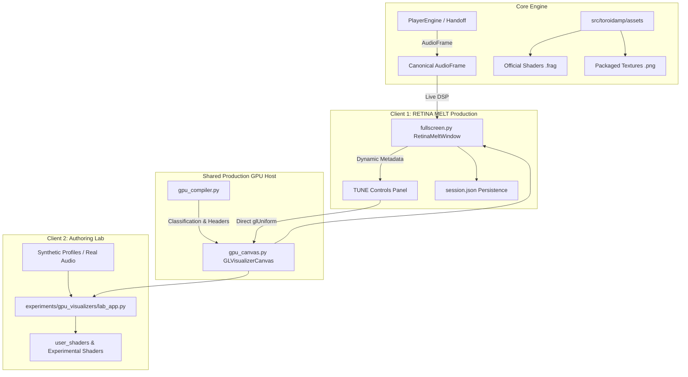

# ToroidAMP — GPU-PROD-001: RETINA MELT GPU Host Integration + Live Tune Controls

---

## 1. Executive Summary & Purpose

```text
================================================================================
           RETINA MELT GPU HOST INTEGRATION & LIVE TUNE CONTROLS (GPU-PROD-001)
================================================================================
STATUS        : OPEN / HUMAN GATE FAILED — STABILIZATION CUT IN PROGRESS
CORE PRINCIPLE: NORMAL/MINI -> LISTEN TO THE MUSIC
                RETINA MELT -> PLAY WITH HOW THE MUSIC LOOKS (LIVE TUNE)
                VISUALIZER LAB -> CREATE & TEST THE RULES (AUTHORING)
================================================================================
```

GPU-PROD-001 transitions ToroidAMP's validated hardware-accelerated GLSL pipeline from the experimental authoring sandbox into the **production RETINA MELT fullscreen playback experience**.

### Human Gate Failure & Stabilization Diagnosis
1. **RETINA Re-Entry Failure (Root Cause & Fix)**:
   - *Failure*: Entering RETINA MELT, exiting, and re-entering left the visualizer broken or black.
   - *Root Cause*: `RetinaMeltWindow.hideEvent` previously invoked `self.gpu_canvas.cleanupGL()`, destroying `_vao`, `_vbo`, and `_texture0`. When shown again, Qt does not re-call `initializeGL()`.
   - *Fix*: Keep OpenGL resources alive across hide/show cycles. Only release resources upon Qt OpenGL context destruction (`ctx.aboutToBeDestroyed`). Re-initialize dynamically if context was ever recreated.
2. **Explicit HUD Visibility & Click Pinning**:
   - *Failure*: Controls disappeared too aggressively; passive mouse movements were unreliable.
   - *Fix*: Explicit 3-state HUD model (`HUD_PINNED`, `HUD_VISIBLE`, `HUD_HIDDEN`). **Left Click** explicitly pins the HUD visible and stops the auto-hide timer. **Right Click** immediately dismisses the HUD and closes the TUNE panel.
3. **TUNE Slider Focus & Live Event Capture**:
   - *Failure*: Sliders lost focus or were intercepted during drag.
   - *Fix*: Background canvas event filter delegates cleanly to HUD state while slider widgets retain exclusive mouse grab and direct uniform binding without hitching.
4. **Normal-Mode Visualizer Recovery**:
   - *Failure*: Visualizer panel in Normal mode could freeze or become black after returning from RETINA MELT.
   - *Fix*: Implemented native multi-color CPU fallback rings in `ToroidIdentityVisualizer.render()` and ensured mode synchronization across window scales.
5. **Initial Presentation State Synchronization (Final Micro-Fix)**:
   - *Failure*: On initial player startup with Toroid Identity selected / restored from session, NORMAL mode failed to display the RETINA-only placeholder until the user manually cycled visualizer modes.
   - *Root Cause*: `WindowManager._apply_restored_session` directly mutated `vis_mod.vis_idx` without triggering the visualizer module's stacked presentation layout update. Presentation synchronization was previously attached only to the button click event handler.
   - *Fix*: Converted `VisualizerModule.vis_idx` into an authoritative property with setter that invokes single-truth `sync_visualizer_presentation()`. All assignments (session restoration, startup, manual mode switch, RETINA return) automatically synchronize the presentation stack immediately.

---

## 2. Architecture: One GPU Host, Two Clients



### Module Responsibilities

| Component | Path | Responsibility |
| :--- | :--- | :--- |
| **GPU Compiler** | [`src/toroidamp/visualizers/gpu_compiler.py`](file:///C:/ToroidAMP/ToroidAMP/src/toroidamp/visualizers/gpu_compiler.py) | Parses `// [param:float]` metadata; synthesizes ToroidAMP & Shadertoy wrapper headers. |
| **GPU Host Canvas** | [`src/toroidamp/visualizers/gpu_canvas.py`](file:///C:/ToroidAMP/ToroidAMP/src/toroidamp/visualizers/gpu_canvas.py) | Hardware OpenGL viewport (`QOpenGLWidget`), VAO/VBO attribute bindings, `QOpenGLTexture` lifecycle, and direct `QOpenGLFunctions` uniform uploads. |
| **Visualizer Descriptor** | [`src/toroidamp/visualizers/toroid_identity.py`](file:///C:/ToroidAMP/ToroidAMP/src/toroidamp/visualizers/toroid_identity.py) | Production visualizer descriptor exposing metadata, parameter declarations, and shader path. |
| **RETINA MELT Host** | [`src/toroidamp/ui/fullscreen.py`](file:///C:/ToroidAMP/ToroidAMP/src/toroidamp/ui/fullscreen.py) | Fullscreen presentation window with stacked CPU/GPU surfaces, playback HUD, and dynamic `[ TUNE ]` overlay. |
| **Authoring Lab** | [`experiments/gpu_visualizers/lab_app.py`](file:///C:/ToroidAMP/ToroidAMP/experiments/gpu_visualizers/lab_app.py) | Authoring playground for external shaders, diagnostics, manual beat injections, and synthetic audio profiles. |

---

## 3. The `[ TUNE ]` User Experience

### Interaction Workflow
1. User enters RETINA MELT (`F` or `⛶ MELT` in chassis).
2. Cycles to **`MODE: TOROID IDENTITY (GPU)`** (`M` or `MODE` button).
3. The HUD displays the **`⚙ TUNE`** button (automatically hidden when on CPU visualizers).
4. Clicking `⚙ TUNE` (or pressing `T`) slides open the compact dark overlay panel directly above the HUD.
5. While the TUNE panel is open:
   * HUD auto-hide is **suspended** so sliders never disappear under the cursor.
   * Playback controls (`Play/Pause`, `Seek`, `Volume`, `Next/Prev`) remain fully operational.
   * Modifying sliders immediately uploads new scalar floats to the GPU via `glUniform1f` without frame hitching or recompilation.
6. Clicking `↺ RESET` restores the author-declared defaults in the UI, GPU, and `session.json`.
7. Pressing `ESC`, `T`, or `✕` cleanly closes the panel, resuming normal 2.5s HUD auto-hide.

---

## 4. Parameter Persistence Contract

In [`src/toroidamp/session.py`](file:///C:/ToroidAMP/ToroidAMP/src/toroidamp/session.py):
```python
@dataclass
class SessionState:
    ...
    visualizer_parameters: dict[str, dict[str, float]] = field(default_factory=dict)
```

* **Storage**: Saved atomically into `%LOCALAPPDATA%/ToroidAMP/session.json` under `visualizer_parameters["toroid_identity"]`.
* **Sanitization & Clamping**: Stale or unknown parameters from earlier builds are ignored; corrupted data types default safely; numbers are clamped strictly to `[min_value .. max_value]`.

---

## 5. NORMAL-Mode Policy: Deliberate RETINA-Only Placeholder

### Rationale & Feasibility
Attempting to host live hardware-accelerated OpenGL rendering inside the compact `VisualizerModule` in NORMAL mode would require:
1. A second `QOpenGLWidget` context or complex widget reparenting choreography;
2. Duplicate GPU render loop management when both windows are open;
3. Significant potential for context-sharing bugs and GPU overhead on compact desktop layouts.

### Branded Placeholder Experience
Instead, ToroidAMP adopts an explicit product policy: **Official GPU Visualizers are RETINA MELT experiences**.

When a GPU/RETINA-only visualizer (such as `Toroid Identity`) is selected in NORMAL mode:
* The module displays an intentional, branded placeholder (`// HARDWARE GPU VISUALIZER //`).
* It features a dedicated **`⛶ ENTER RETINA MELT`** button.
* Single-clicking the button transitions directly into RETINA MELT fullscreen playback with `Toroid Identity` actively rendering immediately.
* Returning to NORMAL mode (`ESC` or `EXIT`) restores the intentional placeholder without any black frame artifacts or desynchronization.

---

## 6. Automated Validation & Test Suite

All 34 unit and integration tests across the GPU subsystem pass in $<1.8\text{ s}$:
* [`tests/test_gpu_prod_001_stabilization.py`](file:///C:/ToroidAMP/ToroidAMP/tests/test_gpu_prod_001_stabilization.py) (5 tests):
  * `test_multi_cycle_retina_reentry`: 5-cycle exit/re-entry preserving GL resources and context bindings.
  * `test_explicit_hud_visibility_left_right_click`: Left-click PIN and Right-click DISMISS.
  * `test_tune_slider_event_and_parameter_propagation`: TUNE slider event ownership and direct uniform mutation.
  * `test_normal_mode_retina_only_placeholder`: RETINA-only branded placeholder in NORMAL mode.
  * `test_one_click_retina_melt_entry_and_return`: One-click RETINA entry preserving playback, volume, and visualizer identity.
* [`tests/test_gpu_prod_001.py`](file:///C:/ToroidAMP/ToroidAMP/tests/test_gpu_prod_001.py) (6 tests): Integration baseline.
* [`tests/test_gpu_official_001.py`](file:///C:/ToroidAMP/ToroidAMP/tests/test_gpu_official_001.py) (5 tests): Official shader authoring & parameter propagation.
* [`tests/test_exp_vislab_002.py`](file:///C:/ToroidAMP/ToroidAMP/tests/test_exp_vislab_002.py) (6 tests): Lab regression & external shader compatibility.
* [`tests/test_exp_vislab_001.py`](file:///C:/ToroidAMP/ToroidAMP/tests/test_exp_vislab_001.py) (6 tests): Lab architecture foundation.
* [`tests/test_exp_gl_001.py`](file:///C:/ToroidAMP/ToroidAMP/tests/test_exp_gl_001.py) (6 tests): OpenGL driver foundation probe.

---

## 7. Manual Human Validation Protocol (For Metal)

To perform live end-to-end verification in the desktop application:

```powershell
py -3.13 src\toroidamp\main.py
```

1. **TEST 1 — HUD PIN & DISMISS**: Enter RETINA MELT -> **Left Click** on background -> verify HUD pins permanently visible. **Right Click** on background -> verify HUD and TUNE dismiss immediately.
2. **TEST 2 — TUNE SLIDERS**: Open TUNE (`T` or `⚙ TUNE`) -> drag sliders across full range. Verify immediate visual distortion/glow/chroma changes and zero loss of focus while dragging.
3. **TEST 3 — RE-ENTRY TORTURE**: Enter RETINA MELT (`F`) -> exit (`ESC`) -> repeat 5 times. Verify Toroid Identity renders sharply every single time without black frames.
4. **TEST 4 — CPU/GPU SWITCHING**: Inside RETINA, switch `3D Torus` -> `Toroid Identity` -> `Deep Field` -> `Toroid Identity`. Verify smooth transitions without audio interruption.
5. **TEST 5 — NORMAL MODE PLACEHOLDER & ONE-CLICK ENTRY**: Select `MODE: TOROID IDENTITY (GPU)` in NORMAL mode. Verify clean branded placeholder. Click `⛶ ENTER RETINA MELT` -> verify player opens directly in RETINA MELT with Toroid Identity actively rendering.
6. **TEST 6 — RETURN FROM RETINA**: Exit RETINA MELT (`ESC`). Verify NORMAL mode cleanly shows the Toroid Identity placeholder (no black frame).
7. **TEST 7 — NORMAL CPU PREVIEWS**: Switch to `3D Torus` or `Waveform Ribbon` in NORMAL mode. Verify real-time CPU visualizer rendering continues normally.
8. **TEST 8 — UNINTERRUPTED PLAYBACK**: Across all tests, verify track playback, timeline seeking, volume adjustment, and track skipping never hitch or pause.
